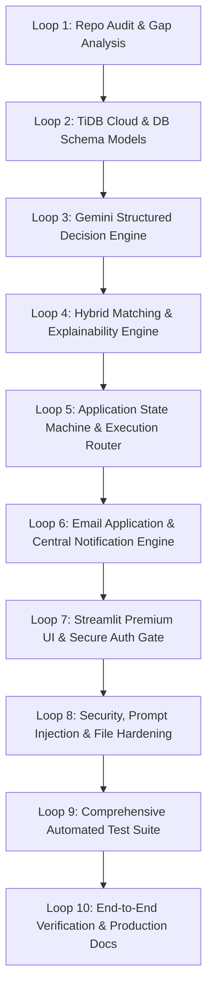

# IMPLEMENTATION PLAN: AI Job Discovery & Application Automation Engine

**Project:** `automate_job_apply`  
**Stack:** Google Gemini API (Structured Outputs) + TiDB Cloud + Streamlit Community Cloud + Python / SQLAlchemy / AsyncIO  
**Architecture:** Deterministic Hybrid Engine (Gemini AI Classification + Grounded Rules + Human-in-the-loop + Multi-Channel Notifications + Idempotent Execution)

---

## 1. Executive Summary & Goals

This plan establishes the iterative roadmap to evolve the existing `automate_job_apply` codebase into a resilient, production-grade automated job discovery and application platform. The system uses **Google Gemini** as a structured decision layer (Pydantic-validated), persistent storage on **TiDB Cloud**, a secure **Streamlit** dashboard with login gating, human review workflows, dedicated **Email Application** execution, and automated **Event Notification & Audit Logging**.

---

## 2. Iterative Engineering Loops (Loops 1–10)

---

### Loop 1: Repository Audit & Architecture Gap Report
- [x] Full scan of existing backend, models, workers, job sources, Streamlit UI, and test suites.
- [x] Catalog all reusable components (models, services, parsers, source adapters).
- [x] Document missing requirements in `ARCHITECTURE_GAP_REPORT.md` and `IMPLEMENTATION_PLAN.md`.

### Loop 2: TiDB Cloud & Unified Database Architecture
- [ ] Upgrade SQLAlchemy database engine configuration in `app/core/database.py` to support TiDB Cloud (`mysql+aiomysql://` with SSL parameters, connection pooling, reconnection resilience, and SQLite fallback for local testing).
- [ ] Complete all entity tables in `app/models/`:
  - `users`, `candidate_profiles` (mapped to `user_profiles`)
  - `resumes`, `resume_versions`, `skills`
  - `job_sources` (`job_source_configs`), `jobs`, `job_requirements`, `job_matches`
  - `applications`, `application_packages`, `application_answers`, `application_reviews`, `application_events`, `execution_attempts`
  - `outbound_emails`, `notifications`, `automation_rules` (`automation_settings`), `automation_runs` (`scheduler_runs`), `audit_logs`.
- [ ] Provide unified migration/init script with auto-index creation and idempotency constraints.

### Loop 3: Google Gemini Structured Decision Engine
- [ ] Implement modular package `backend/app/ai/decision_engine/`:
  - `schemas.py`: `JobDecision` and `EmailApplicationExtraction` Pydantic models with 0.0–1.0 score validations and strictly typed literals (`HIGH_MATCH`, `HUMAN_REVIEW`, `LOW_MATCH`, `email`, `authorized_api`, `manual`, `unknown`).
  - `prompts.py`: Untrusted JD isolation (anti-prompt-injection), candidate ground-truth enforcement (no hallucinated skills/experience).
  - `validators.py`: Score bounds validation, consistency checks, email regex verification.
  - `confidence.py`: Composite confidence scoring combining model confidence, skill overlap, resume evidence, and semantic embedding alignment.
  - `gemini_provider.py`: Google GenAI SDK integration supporting structured outputs via JSON Schema, graceful fallback to `google-generativeai` and deterministic mock fallback for offline resilience.
  - `decision_engine.py`: Central engine orchestrating Gemini inference and Python business rule routing.

### Loop 4: Explainable Hybrid Matching Engine
- [ ] Upgrade `MatchingEngineService` in `app/services/matching_engine.py` to calculate and store:
  - `overall_match`, `role_match`, `skills_match`, `experience_match`, `seniority_match`, `semantic_match`, `location_match`, `salary_match`, `confidence`, `matched_skills`, `missing_skills`, `concerns`.
- [ ] Integrate Gemini Embeddings with cosine similarity and local fallback.
- [ ] Ensure non-hallucinatory scoring with complete explainability breakdown.

### Loop 5: Application State Machine & Execution Router
- [ ] Implement robust state machine transitions:
  `DISCOVERED` → `NORMALIZED` → `MATCHED` → `PREPARED` → `REVIEW_REQUESTED` → `APPROVED` / `REJECTED` → `SUBMISSION_STARTED` → `EMAIL_SENT` / `SUBMITTED` → `VERIFIED` / `FAILED` / `NEEDS_ACTION` / `DUPLICATE_SKIPPED`.
- [ ] Persist all state transitions with timestamped metadata into `application_events` and `audit_logs`.
- [ ] Implement multi-adapter execution architecture:
  - `EmailApplicationExecutor` (automatic email generation, resume attachment, outbound tracking)
  - `AuthorizedAPIApplicationExecutor` (official API endpoints)
  - `ManualApplicationExecutor` (assisted manual submission packet download)

### Loop 6: Email Application & Centralized Notification System
- [ ] Implement automated regex + Gemini detection for email-based job applications.
- [ ] Implement `NotificationService` in `app/services/notification_service.py` with deduplication via `event_id`, rate limiting, and HTML/text templating.
- [ ] Create `OutboundEmail` tracking with idempotency keys and retry counters.
- [ ] Support notification triggers for: `NEW_HIGH_MATCH_JOB`, `HUMAN_REVIEW_REQUIRED`, `APPLICATION_APPROVED`, `APPLICATION_REJECTED`, `EMAIL_APPLICATION_SENT`, `APPLICATION_SUBMITTED`, `APPLICATION_VERIFIED`, `APPLICATION_FAILED`, `AUTOMATION_RUN_COMPLETED`.

### Loop 7: Streamlit Community Cloud UI & Auth Gate
- [ ] Implement strict authentication barrier in `app.py`: first screen is a secure password gate using `APP_PASSWORD_HASH` (bcrypt/argon2 verification). Zero dashboard access prior to successful login.
- [ ] Implement rich, interactive dashboard tabs:
  1. **Dashboard Overview**: Key metrics (Jobs Today, High Matches, In Review, Submitted, Email Apps, Failed).
  2. **Job Board**: Filtering, match score badges, detailed requirement breakdown.
  3. **High Matches & Human Review**: Approve, Reject, and Edit workflow with instant DB persistence and notifications.
  4. **Applications Tracking**: Detailed lifecycle tracker, answer copy tool, resume download.
  5. **Email Applications**: Dedicated view of outbound emails, recipient tracking, and send status.
  6. **Automation Controller**: Persistent run lock, progress steps display, mode selection (SAFE_MODE, ASSISTED_MODE, AUTHORIZED_AUTO_MODE).
  7. **Analytics**: Visual breakdown of match scores, top skills, source conversion.
  8. **Audit Logs & Settings**: Security audit logs and configurable thresholds.
- [ ] Implement shared `AutomationService` used by both the Streamlit UI and the standalone CLI worker (`python -m backend.app.workers.run_automation`).

### Loop 8: Security, Prompt Injection & File Safety Audit
- [ ] Audit repository to verify zero plaintext secrets in code or git history.
- [ ] Create comprehensive `.streamlit/secrets.toml.example` and `.env.example`.
- [ ] Implement prompt injection safeguards and email recipient sanitization.
- [ ] Validate file upload size, MIME types, and path traversal prevention.

### Loop 9: Automated Test Suite & Quality Verification
- [ ] Develop comprehensive test cases covering authentication, TiDB/SQLite models, Gemini structured outputs, Pydantic validation, job extraction, matching, deduplication, human review approval/rejection, email application, idempotency, retry mechanisms, and automation run locks.
- [ ] Execute `pytest` across all test suites and fix all warnings/failures.

### Loop 10: Final Documentation & Production Verification
- [ ] Generate comprehensive documentation:
  - `DATABASE_SCHEMA.md`
  - `GEMINI_DECISION_ENGINE.md`
  - `APPLICATION_WORKFLOW.md`
  - `EMAIL_WORKFLOW.md`
  - `DEPLOYMENT.md`
  - `SECURITY_AUDIT.md`
  - `TEST_REPORT.md`
  - `ENVIRONMENT_VARIABLES.md`
