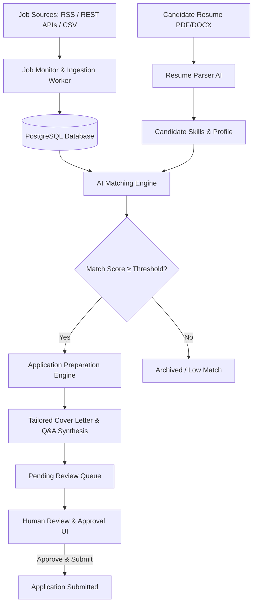

# AI Job Application Automation Agent

An enterprise-grade, TOS-compliant autonomous AI agent designed to discover, match, analyze, tailor, and prepare job applications with strict **human-in-the-loop review**.

---

## 🌟 Key Capabilities & Features

### 1. Job Discovery Engine
- **Multi-Source Feeds**: Built-in adapters for RemoteOK (RSS), WeWorkRemotely (RSS), Remotive (API), and Arbeitnow (API).
- **Custom Adapters**: Modular architecture supporting easily extensible scrapers and company career portal webhooks.
- **Smart Duplicate Prevention**: Cryptographic description hashing and URL normalization to eliminate duplicate listings across providers.
- **Manual & CSV Importer**: Batch import job listings directly from spreadsheets or manual paste.

### 2. AI Semantic Matching & Analysis
- **Entity Extraction**: Parses PDF/DOCX resumes to extract verified technical skills, soft skills, seniority, and career milestones.
- **Multi-Factor Match Scoring**:
  - **Skills Match**: Weighted semantic coverage of required and preferred skills.
  - **Experience Alignment**: Calculates seniority and years of domain experience fit.
  - **Role & Title Similarity**: Measures domain and level alignment.
  - **Composite Score (0–100%)**: Clear, transparent match scores with detailed rationale and missing skill flags.
- **LLM Abstraction**: Compatible with OpenAI, Azure OpenAI, Anthropic, Ollama, and local vLLM instances.

### 3. Application Package Synthesis (Human-In-The-Loop)
- **AI Tailored Resumes**: Generates role-targeted accomplishment bullets highlighting exact competencies requested in the job description.
- **Bespoke Cover Letters**: Generates crisp, high-impact, professional cover letters (strictly under 300 words).
- **Screening Q&A Generator**: Predicts and synthesizes well-structured candidate answers for common screening questions.
- **Strict Human Approval Gate**: Applications remain in `READY_FOR_REVIEW` until you review, edit in-place, and click `Approve`.

### 4. Background Automation & Scheduler
- **APScheduler Service**: Configurable automated polling intervals (5m, 10m, 30m, 60m).
- **Match Threshold Filter**: Only queue applications meeting candidate-specified match thresholds (e.g. ≥ 75%).
- **Immutable Audit Logging**: Every system action, automated scan, and manual user decision is logged with tamper-evident records.

### 5. Modern Dashboard & Visual Analytics
- **Live Funnel & KPIs**: Track conversion rates from Discovered → Match Filtered → Prepared → Approved → Submitted → Interviews.
- **Score Distribution Visualizer**: Inspect match distributions across all tracked positions.
- **Notification Center**: Real-time alerts for newly discovered high-match opportunities.

---

## 🏗️ Architecture Overview



---

## 🚀 Quick Start Guide

### Prerequisites
- Python 3.12+
- Node.js 18+ and npm
- PostgreSQL & Redis (or use Docker Compose)

### 1. Backend Setup

```bash
cd backend
python -m venv venv
# On Windows:
.\venv\Scripts\activate
# On Linux/macOS:
source venv/bin/activate

pip install -r requirements.txt
cp ../.env.example .env

# Run database seed (creates demo AI engineer profile & sample jobs)
python -m app.seed

# Start backend server
uvicorn app.main:app --reload --port 8000
```

FastAPI interactive documentation available at: `http://localhost:8000/docs`

### 2. Frontend Setup

```bash
cd frontend
npm install
npm run dev
```

Open your browser at: `http://localhost:3000`

**Pre-seeded Demo Credentials:**
- Email: `alex.mercer@example.com`
- Password: `Secret123!`

---

## 🐳 Docker Deployment

To launch the complete stack with a single command:

```bash
docker-compose up --build -d
```

Services started:
- `job_agent_frontend`: `http://localhost:3000`
- `job_agent_backend`: `http://localhost:8000`
- `job_agent_postgres`: Port 5432
- `job_agent_redis`: Port 6379

---

## 🧪 Running Automated Tests

```bash
cd backend
pytest
```

---

## 🛡️ Terms of Service & Ethical Compliance Notice

This system is engineered strictly with **ethical automation standards**:
1. **Zero Anti-Bot / CAPTCHA Evasion**: Does not attempt to bypass platform CAPTCHAs, bot detections, or scrape unauthorized endpoints.
2. **Human-in-the-Loop**: Every submission is prepared as an offline draft and requires direct human review and explicit authorization.
3. **Open Standards**: Relies primarily on public RSS feeds, permitted developer APIs, and direct user file imports.
